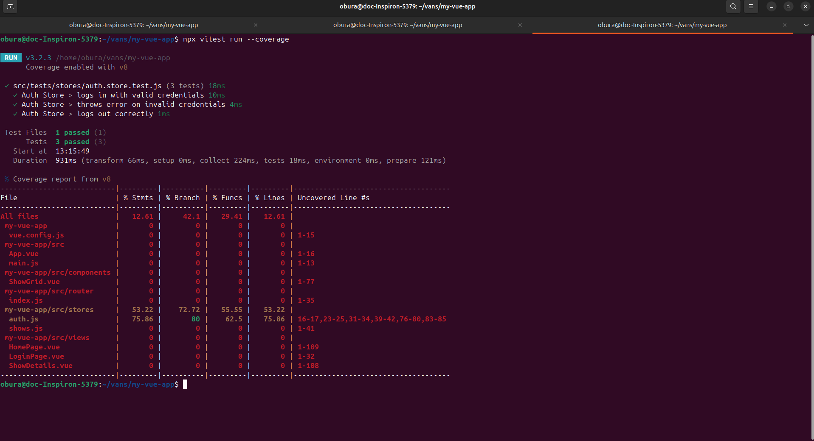

## 🚀 Project Setup

## live links 

https://tevvo-dt4h.vercel.app/

### Install dependencies
```bash
npm install
## Start development server
npm run serve


## 🔐 Auth Implementation

- Uses a **mock login** system via Pinia store.
- Credentials: 
  username- `admin 
' password -' ' 123`
- Stores a mock token in `localStorage`.
- Implements **auto-logout after 30 minutes of inactivity**.
- Resets the timeout on mouse movement, scroll, or keypress.


## 🧪 Testing

### Run Tests
```bash
npx vitest run --coverage

✓ Auth Store > logs in with valid credentials
✓ Auth Store > throws error on invalid credentials
✓ Auth Store > logs out correctly

## ✅ Test Coverage Screenshot


